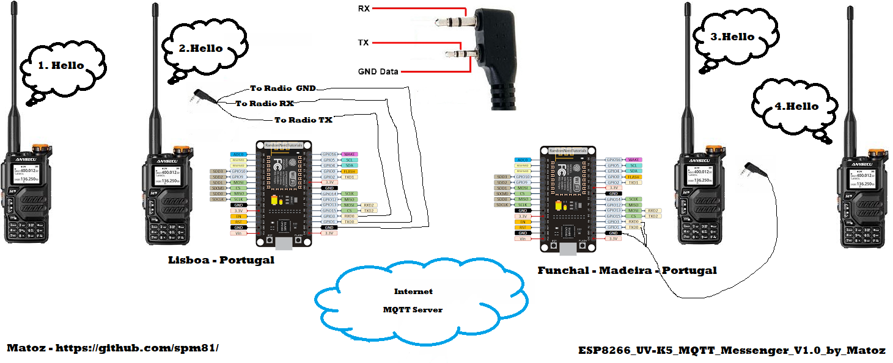
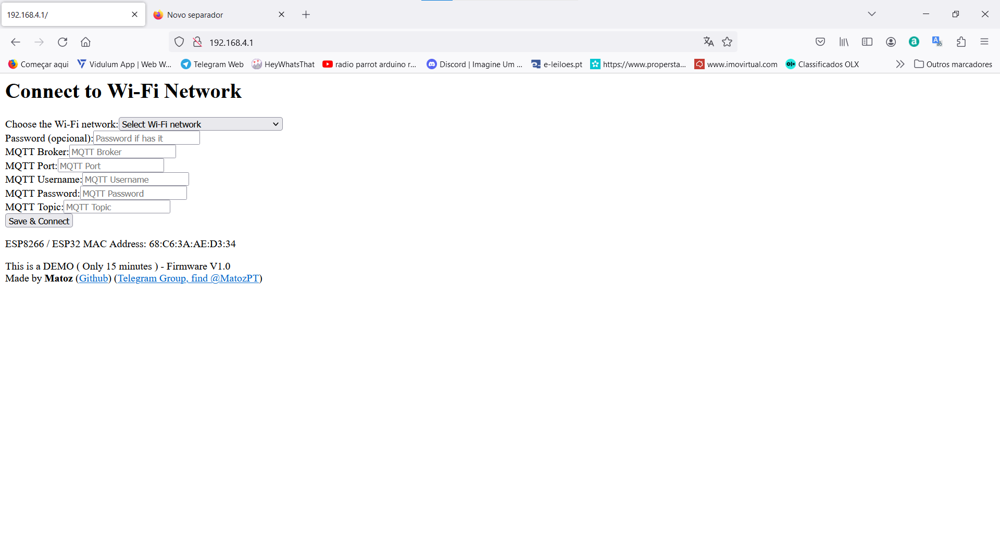
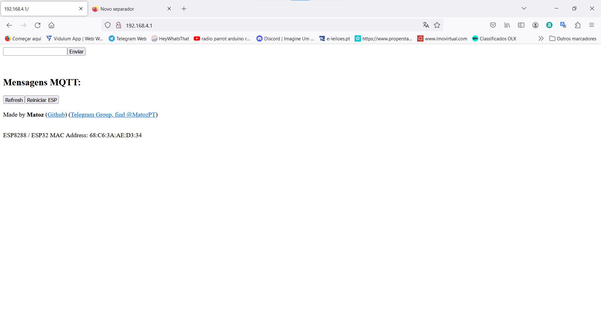
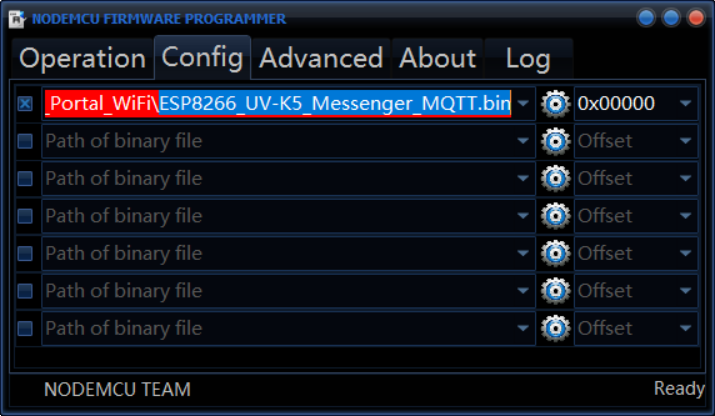
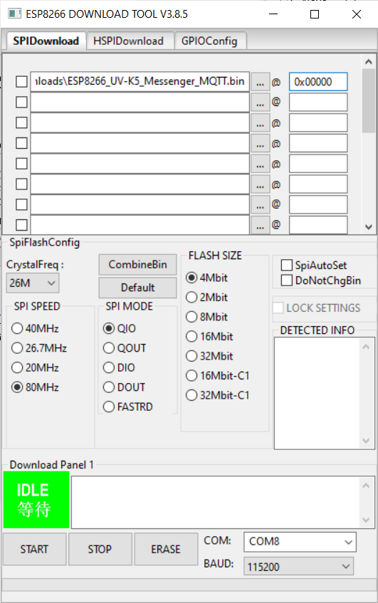

* Podes-me encontrar no [Telegram](https://t.me/PMR446PT) (Portuguese Only) !!! 
 

# Creat your Mesh Messaging  - Info:
**ESP8266 UV-K5 MQTT Messenger by Matoz**

 

* Send and Receive SMS with an MQTT BROKER with your Compatible Messenger Firmware 
* WiFi Access Point Password: 12345678 
* ESP Flash Examples : (offset/address 0x00000)

	**Linux:**
	esptool.py --port /dev/ttyUSB0 write_flash 0x00000 ESP8266_UV-K5_MQTT_Messenger_V1.0_by_Matoz_DEMO.bin

	**Windows:**
	

 

[DOWNLOAD BIN FILE](https://github.com/spm81/Quansheng_UV-K5/raw/main/Arduino%20Codes/BIN%20Files/ESP8266_UV-K5_MQTT_Messenger_V1.0_by_Matoz_DEMO.bin) - ESP8266_UV-K5_MQTT_Messenger_V1.0_by_Matoz_DEMO  

**P.S.: -** Can be used with [Firmware MCFW V0.33.0V](https://github.com/spm81/Quansheng_UV-K5/raw/main/Firmware/UNIVERSAL%20FIRMWARE%20(%20All%20Radios%20-%20UV-K5,%20UV-K5(8),%20UV-K6,%20UV-5R%20Plus,%20etc...)/Custom%20Firmware%20by%20Matoz%20(%20spm81%20)/Custom_Firmware_by_Matoz_V0.33.0C.bin) or other firmware compatible with the QuanSheng UV-K5 with Messenger.

