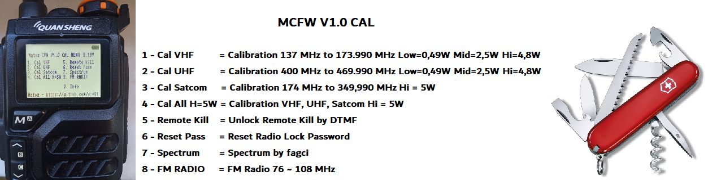
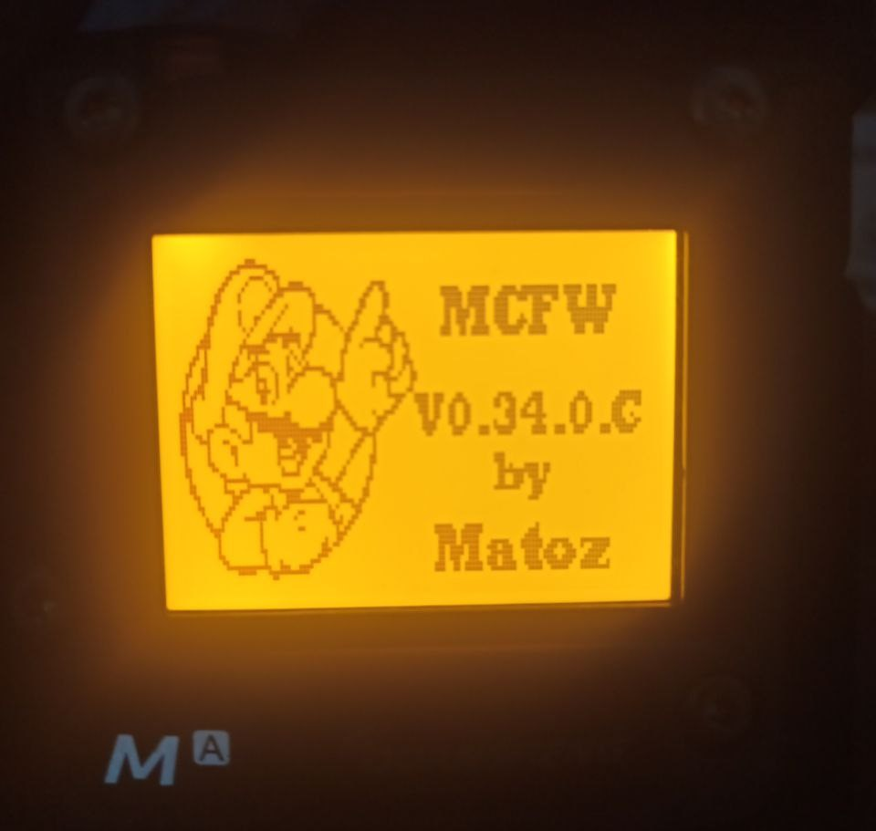
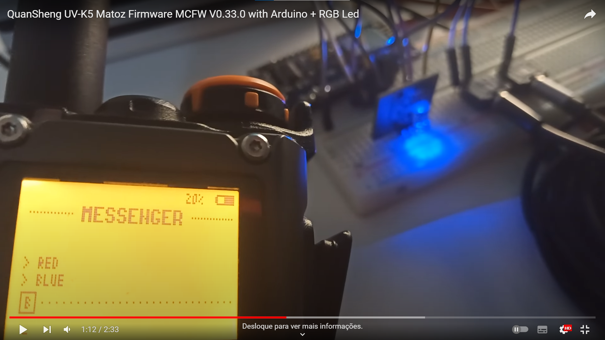

* Podes-me encontrar no [Telegram](https://t.me/PMR446PT) (Portuguese Only) !!! 
 
* [FLASH VIA WEB BROWSER HERE}(https://egzumer.github.io/uvtools/)  

# Tunning Firmwares by Matoz - Info:

**MCFW V1.0 CAL** ( Password to apply: 123400 )

  

**MCFW V0.02 CAL** - Power transmitter calibration (Hi= 5W) applied to frequencies 174MHz to 349.990 MHz (SATCOM) + (Low= 0.49W Mid= 2.5W Hi= 4.95W) applied to frequencies 137 MHz to 173.990 MHz and 400 MHz to 469.990 MHz. Please Backup your Configuration first with [k5prog_win.exe](https://github.com/spm81/Quansheng_UV-K5/blob/main/Software/k5prog_win.exe) if you want to go back to your default configuration
, Need Password to apply the calibration: 123400) 
**MCFW V0.01 CAL** - Power transmitter calibration (Low= 0.49W Mid= 2.5W Hi= 4.95W) applied to frequencies 137 MHz to 173.990 MHz and 400 MHz to 469.990 MHz. Please Backup your Configuration first with [k5prog_win.exe](https://github.com/spm81/Quansheng_UV-K5/blob/main/Software/k5prog_win.exe) if you want to go back to your default configuration
, Need Password to apply the calibration: 123400) 

# Custom Firmware by Matoz (MCFW) - Info:

* Firmware differences (ONLY ON SPECTRUM (with fagci_style_keys at the end of the file it means it's with Fagci Keys, without fagci_style_keys at the end of the file it means it's an Old Keys Style))
* A = [Based on OneofEleven Firmware **(Best for SATCOM ONLY From V0.23A)**](https://github.com/OneOfEleven/uv-k5-firmware-custom)
* B = [Based on Tunas1337 Firmware ( Also based on Dual Tachyon Firmware ) **(Best for SATCOM)**](https://github.com/Tunas1337/uv-k5-firmware)
* C = [Based on Fagci Firmware ( Also based on Dual Tachyon Firmware ) **(Best for SATCOM)**](https://github.com/fagci/uv-k5-firmware-fagci-mod)
* CAL = Only for Calibrate your radio

* Improvement on SQL ( Thanks to **SP4UBW** ) 
* Thanks to [**joaquimorg**](https://github.com/joaquimorg)  for recovering Messenger originally from @piotr022 and improving it a lot also for the appearance of memorized channels in the spectrum. 
* Podes-me encontrar no [Telegram](https://t.me/PMR446PT) (Portuguese Only) !!! 
* **Feel free to improve my firmware** - [Here is my Source Code of MCFW](https://github.com/spm81/MCFW_UV-K5_Open_Source_Firmware)  

**MCFW V0.34.0C** - Based on MCFW V0.31.xC ( With better improvement on SQL and DTMF Disabled ) 
I would like to thank [**nrlourenco**](https://github.com/nrlourenco) and especially [**joaquimorg**](https://github.com/joaquimorg) for helping me with this firmware version  

**NEW on this Firmware** :

	* Squelch in MENU resolved 
	* Resolved ScanList start
	* Resolved minor things

	* Added to MENU BatSave 1:5, 1:6, 1:7, 1:8, 1:9 (Greater battery saving on radio)
	* Added Encryption to Messenger
	* Added MsgEnc MENU to Messenger
	* Added MsgAck MENU to Messenger
	* Added MENU MsgRBN(Roger Beep Notification) to Messenger
	* Added MENU MsgMod (AFSK 1.2K / FSK 700 / FSK 450) to Messenger
	* Added LIST1+2 to MENU SList (only searches for channels memorized from list 1 and list 2).
	* Added MENU LCD Inv (LCD Inverter), inverts the colors to the radio
	* Added the SATCOM MENU (Note: Search with OFF and ON, as some frequencies work best in OFF and others in ON. 
 		When selecting ON or OFF you will have to change frequency/memory for it to take effect.)
	* Added the PTTHOLD MENU, when you press the PTT button once it will become active until you press the PTT button again, that is, press it once to activate and once to turn off.
	* Added MENU M CALL, when activating M CAL when receiving a call or RX is activated (Only when it enters SAVE MODE), the LED will blink and there will be a missed call on the LCD.
	* Added more Rogers Beeps among other minor things

	* FM RADIO only has VFO, i.e. manual search

	* Secret MENU to change permissions regarding TX - POWER+FN1
	* MCFW Secret MENU to delete LOCK and Messenger Passwords - POWER+M
   

# Messenger Keys
   "*" - Change keyboard, Upper case, Lower case, Numeric. 
   "0" - Space, except in numeric mode. 
   "F" - Backspace. 
   "(Long press) F" - Clear all messages. 
   "UP" - Recalls last sent message. 
   "M" - Transmits message in the frequency of active VFO. 
   "Exit" - Close application.  

    
**MCFW V0.33.0C** - Based on MCFW V0.31.xC ( With better improvement on SQL and DTMF Disabled ) 
**NEW on this Firmware** : Normal Screen or Negative Screen Versions + Better improvement on SQL then last version + TX RSSI Bar + Messenger with audible notification of message reception by the receiver and visual notification in case of message received on VFO + Six Rogers Beeps + Battery percentage, you need to go to the MENU to choose your battery if it is 1600mAh or 2200mAh 
					**Version:** 
     						* Messenger + Six Roger Beeps + FM Radio + Spectrum + SList Editor + TX RSSI Bar + Battery percentage
	   
**MCFW V0.32.0C** - Based on MCFW V0.31.xC ( With good improvement on SQL + SList Editor ) 
					* FM Radio Version  
					* Spectrum All Registers Secret Menu Version  
					* Messenger Version ( Thanks to [**joaquimorg**](https://github.com/joaquimorg)  for recovering Messenger originally from @piotr022 )  
					* Messenger + FM Radio - NO Spectrum App

**MCFW V0.31.9C** - Based on Open Spectrum Firmware - Facgi Spectrum OSFW-c8ae8a5 ( Disable FM Radio + AM Fix + appearance of memorized channels in the spectrum ( Thanks to **joaquimorg** ) + Scan All Scan List 1+2 together + 2nd ToneBurst 1750Hz and 1050Hz = PTT + Sidekey 1, PTT + Sidekey 2 + Fast Scan like 1of11 + Added Roger Beep Motorola on the Menu + Improvement on SQL (better) + Flashlight SOS function + Improvement in SATCOM reception + Secret Menu (Spectrum) + Upconverter shift (more frequencies) + ALL TX )  
**MCFW V0.31.8C** - Based on Open Spectrum Firmware - Facgi Spectrum OSFW-c8ae8a5 ( AM Fix + appearance of memorized channels in the spectrum ( Thanks to **joaquimorg** ) + Scan All Scan List 1+2 together + 2nd ToneBurst 1750Hz and 1050Hz = PTT + Sidekey 1, PTT + Sidekey 2 + Fast Scan like 1of11 + Added Roger Beep Motorola on the Menu + Improvement on SQL (better) + Flashlight SOS function + Improvement in SATCOM reception + Upconverter shift (more frequencies) + ALL TX )  
**MCFW V0.31.7C** - Based on Open Spectrum Firmware - Facgi Spectrum OSFW-c8ae8a5 ( Disable FM Radio + Scan All Scan List 1+2 together + 2nd ToneBurst 1750Hz and 1050Hz = PTT + Sidekey 1, PTT + Sidekey 2 + Fast Scan like 1of11 + Added Roger Beep Motorola on the Menu + Improvement on SQL (better) + Flashlight SOS function + Improvement in SATCOM reception + Secret Menu (Spectrum) + Upconverter shift (more frequencies) + ALL TX )  
**MCFW V0.31.6C** - Based on Open Spectrum Firmware - Facgi Spectrum OSFW-c8ae8a5 ( Scan All Scan List 1+2 together + 2nd ToneBurst 1750Hz and 1050Hz = PTT + Sidekey 1, PTT + Sidekey 2 + Fast Scan like 1of11 + Added Roger Beep Motorola on the Menu + Improvement on SQL (better) + Flashlight SOS function + Improvement in SATCOM reception + Upconverter shift (more frequencies) + ALL TX )  
**MCFW V0.31.5C** - Based on Open Spectrum Firmware - Facgi Spectrum OSFW-c8ae8a5 ( Disable FM Radio + Fast Scan like 1of11 + Added Roger Beep Motorola on the Menu + Improvement on SQL (better) + Flashlight SOS function + Improvement in SATCOM reception + Secret Menu (Spectrum) + Upconverter shift (more frequencies) + ALL TX )  
**MCFW V0.31.4C** - Based on Open Spectrum Firmware - Facgi Spectrum OSFW-c8ae8a5 ( Fast Scan like 1of11 + Added Roger Beep Motorola on the Menu + Improvement on SQL (better) + Flashlight SOS function + Improvement in SATCOM reception + Upconverter shift (more frequencies) + ALL TX )  
**MCFW V0.31.3C** - Based on Open Spectrum Firmware - Facgi Spectrum OSFW-c8ae8a5 ( Disable FM Radio + Added Roger Beep Motorola on the Menu + Improvement on SQL + Flashlight SOS function + Improvement in SATCOM reception + Secret Menu (Spectrum) + Upconverter shift + ALL TX )  
**MCFW V0.31.2C** - Based on Open Spectrum Firmware - Facgi Spectrum OSFW-c8ae8a5 ( Added Roger Beep Motorola on the Menu + Improvement on SQL + Flashlight SOS function + Improvement in SATCOM reception + Upconverter shift + ALL TX )  
**MCFW V0.31.1C** - Based on Open Spectrum Firmware - Facgi Spectrum OSFW-c8ae8a5 ( Disable FM Radio + Added Roger Beep Motorola on the Menu + Improvement on SQL + Flashlight SOS function + Improvement in SATCOM reception + Secret Menu (Spectrum) + ALL TX )  
**MCFW V0.31C** - Based on Open Spectrum Firmware - Facgi Spectrum OSFW-c8ae8a5 ( Improvement on SQL + Flashlight SOS function + Improvement in SATCOM reception + ALL TX )  

**MCFW V0.30C** - Based on Open Spectrum Firmware - Facgi Spectrum OSFW-f95df07 ( Improvement on SQL + Flashlight SOS function + Improvement in SATCOM reception + ALL TX )  

**MCFW V0.29.1C** - Based on Open Spectrum Firmware - Facgi Spectrum OSFW-bc9a456 ( Improvement on SQL ( Thanks to **SP4UBW** ) + Flashlight SOS function + Improvement in SATCOM reception + Small Bold + ALL TX )  
**MCFW V0.29C** - Based on Open Spectrum Firmware - Facgi Spectrum OSFW-bc9a456 ( Improvement in SATCOM reception + Small Bold + ALL TX )  
**MCFW V0.29A** - Based on Open Spectrum Firmware - Based on OneofEleven OEFW-024c4bb with facgi Spectrum OSFW-bc9a456 ( FM RADIO Disable + VOX Disable + Flashlight SOS function + **Real** improvement in SATCOM reception ) 

**MCFW V0.28C** - Based on Open Spectrum Firmware - Facgi Spectrum OSFW-73bdc95 ( FM RADIO Disable + improvement in SATCOM reception + Small Bold + Secret Menu (Spectrum) + ALL TX ) **( Introducing AM + FM + SSB + BYP + RAW by pressing F+7)**  

**MCFW V0.27C** - Based on Open Spectrum Firmware - Facgi Spectrum OSFW-5a1597c ( Improvement in SATCOM reception + ALL TX ) **( Introducing AM + FM + SSB + RAW by pressing F+7)** 
**MCFW V0.27A** - Based on Open Spectrum Firmware - Based on OneofEleven OEFW-024c4bb with facgi Spectrum OSFW-5a1597c ( FM RADIO Disable + VOX Disable + Flashlight SOS function + **Real** improvement in SATCOM reception ) 

**MCFW V0.26A** - Based on Open Spectrum Firmware - Based on OneofEleven OEFW-4f6063f with facgi Spectrum OSFW-f11b9e1 ( FM RADIO Disable + VOX Disable + Flashlight SOS function + **Real** improvement in SATCOM reception + ALL TX ) 

**MCFW V0.25A** - Based on Open Spectrum Firmware - Based on OneofEleven OEFW-4172e6b with facgi Spectrum OSFW-bd90ca3 ( FM RADIO Disable + VOX Disable + Added Roger Beep Motorola on the Menu + Flashlight SOS function + More Steps + **Real** improvement in SATCOM reception + ALL TX + (Lower Power on Low and Medium )) 

**MCFW V0.24A** - Based on Open Spectrum Firmware - Based on OneofEleven OEFW-73572f2 with facgi Spectrum OSFW-c0ca69e ( FM RADIO Disable + VOX Disable + Added Roger Beep Motorola on the Menu + Flashlight SOS function + More Steps + **Real** improvement in SATCOM reception + (Lower Power on Low and Medium )) 

**MCFW V0.23A** - Based on Open Spectrum Firmware - Based on OneofEleven OEFW-ca78b74 with facgi Spectrum OSFW-c0ca69e ( FM RADIO Disable + VOX Disable + Added Roger Beep Motorola on the Menu + **Real** improvement in SATCOM reception ) 

**MCFW V0.22C** - Based on Open Spectrum Firmware - Facgi Spectrum OSFW-ac45b32 ( Improvement in SATCOM reception + Secret Menu (Spectrum) + ALL TX ) 
**MCFW V0.22B** - Based on Open Spectrum Firmware - New-Menu based on OSFW-009db0c by Tunas1337  with facgi Spectrum OSFW-170f296 ( Improvement in SATCOM reception + Small Bold + Secret Menu (Spectrum) + ALL TX ) 

**MCFW V0.21BX** - Based on Open Spectrum Firmware - New-Menu based on OSFW-009db0c by Tunas1337  with facgi Spectrum OSFW-4514901 ( FM RADIO Disable + improvement in SATCOM reception + Secret Menu (Spectrum) + ALL TX ) 
**MCFW V0.21B** - Based on Open Spectrum Firmware - New-Menu based on OSFW-009db0c by Tunas1337  with facgi Spectrum OSFW-4514901 ( Improvement in SATCOM reception + ALL TX ) 
**MCFW V0.21A** - Based on Open Spectrum Firmware - Based on OneofEleven OEFW-aae4313 with facgi Spectrum OSFW-4514901 ( VOX Disable + improvement in SATCOM reception + ALL TX ) 

**MCFW V0.20A** - Based on Open Spectrum Firmware - Based on OneofEleven OEFW-aae4313 with facgi Spectrum OSFW-b7cf3c5 ( FM RADIO Disable + VOX Disable + Added Roger Beep Motorola on the Menu + improvement in SATCOM reception + Secret Menu (Spectrum) ) 

**MCFW V0.19A** - Based on Open Spectrum Firmware - Based on OneofEleven OEFW-06c7d79 with facgi Spectrum Refactor OSFW-91d9fee ( FM RADIO Disable + VOX Disable + Added Roger Beep Motorola on the Menu + Secret Menu (Spectrum) + ALL TX ) 

**MCFW V0.18A** - Based on Open Spectrum Firmware - Based on OneofEleven OEFW-f93f365 with facgi Spectrum Refactor OSFW-91d9fee ( FM RADIO Disable + VOX Disable + Added Roger Beep Motorola on the Menu + Secret Menu (Spectrum) + ALL TX ) 

**MCFW V0.17A** - Based on Open Spectrum Firmware - Based on OneofEleven OEFW-fd3df27 with facgi Spectrum Refactor OSFW-9ed82fb ( FM RADIO Disable + VOX Disable + Added Roger Beep Motorola on the Menu + Secret Menu (Spectrum) + ALL TX ) 

**MCFW V0.16A** - Based on Open Spectrum Firmware - Based on OneofEleven OEFW-5c346c8 with facgi Spectrum Refactor OSFW-1b6a01a ( FM RADIO Disable + VOX Disable + Added Roger Beep Motorola on the Menu + Secret Menu (Spectrum) + ALL TX ) 

**MCFW V0.15A** - Based on Open Spectrum Firmware - Based on OneofEleven OEFW-1cfb59f with facgi Spectrum Refactor OSFW-1b6a01a ( FM RADIO Disable + VOX Disable + Added Roger Beep Motorola on the Menu + Secret Menu (Spectrum) + ALL TX ) 

**MCFW V0.14A** - Based on Open Spectrum Firmware - Based on OneofEleven OEFW-1cfb59f with facgi Spectrum Refactor OSFW-6193cdd ( FM RADIO Disable + VOX Disable + Added Roger Beep Motorola on the Menu + Secret Menu (Spectrum) ) 

**MCFW V0.13B** - Based on Open Spectrum Firmware - New-Menu based on OSFW-b7c9ee5 by Tunas1337 with facgi Spectrum Refactor OSFW-fae171f ( FM RADIO Disable + RSSI SBar + Voltage + Disable Frequency Copy Timeout + Small Bold + Roger Motorola on Roger Menu + improvement in SATCOM reception ) 
**MCFW V0.13A** - Based on Open Spectrum Firmware - Based on OneofEleven OEFW-9d990f7 with facgi Spectrum Refactor OSFW-fae171f ( FM RADIO Disable + COMPOSER Disable + Added Roger Beep Motorola on the Menu + Secret Menu (Spectrum)) 

**MCFW V0.12A** - Based on Open Spectrum Firmware - Based on OneofEleven OEFW-8fb9825 with facgi Spectrum Refactor OSFW-fae171f ( FM RADIO Disable + COMPOSER Disable + Added Roger Beep Motorola on the Menu + Secret Menu (Spectrum) ) * Bug on Spectrum */F Keys on Custom_Firmware_by_Matoz_V0.12A.bin file 

**MCFW V0.11A** - Based on Open Spectrum Firmware - Based on OneofEleven OEFW-84e1745 with facgi Spectrum Refactor OSFW-c5a39e7 ( FM RADIO Disable + Added Roger Beep Motorola on the Menu + Secret Menu (Spectrum))  

**MCFW V0.10A** - Based on Open Spectrum Firmware - Based on OneofEleven OEFW-2551077 with facgi Spectrum Refactor OSFW-60d0e04 ( Added Roger Beep Motorola on the Menu )  

**MCFW V0.09** - Based on Open Spectrum Firmware - New-Menu based on OSFW-f7657ad by Tunas1337 with facgi Spectrum Refactor OSFW-60d0e04 ( Equal to MCFW V0.0.8 but with some fixes ) 

**MCFW V0.08** - Based on Open Spectrum Firmware - New-Menu based on OSFW-f7657ad by Tunas1337 with facgi Spectrum Refactor OSFW-9a0be17 ( New Menu + Old Style Keys + RSSI SBar + Voltage + Disable Frequency Copy Timeout + Small Bold + Roger Motorola on Roger Menu + improvement in SATCOM reception. ) 

**MCFW V0.07** - Based on Open Spectrum Firmware - New-Menu based on OSFW-f7657ad by Tunas1337 with facgi Spectrum Refactor OSFW-2b7c2dc ( New Menu + Old Style Keys + RSSI SBar + Voltage + Disable Frequency Copy Timeout + Small Bold + improvement in SATCOM reception. ) 

**MCFW V0.06** - Based on Open Spectrum Firmware - OSFW-f7657ad by Tunas1337 with facgi Spectrum + New Menu + Old Style Keys + RSSI + Voltage + Disable Frequency Copy Timeout + improvement in SATCOM reception. 

**MCFW V0.05** - Based on Open Spectrum Firmware - OSFW-7bcb669 by Tunas1337 with facgi Spectrum + New Menu + Old Style Keys + RSSI + Voltage + Disable Frequency Copy Timeout + improvement in SATCOM reception. 

**MCFW V0.04** - Based on Open Spectrum Firmware - OSFW-502a638 by Tunas1337 with facgi Spectrum + New Menu + Old Style Keys + RSSI + Voltage + improvement in SATCOM reception.  

**MCFW V0.03** - Based on Open Spectrum Firmware - OSFW-40e01a6 by Tunas1337 with facgi Spectrum + New Menu + Old Style Keys + RSSI + improvement in SATCOM reception. 

**MCFW V0.02** - Based on Open Spectrum Firmware - OSFW-ecd267e by fagci + Old Style Keys + RSSI + Voltage + improvement in SATCOM reception.  

**MCFW V0.01** - Only release on Telegram for feedback, (buggy version).  

Fagci Spectrum Help (are not the "Old Style Keys" but the rest is equal)
