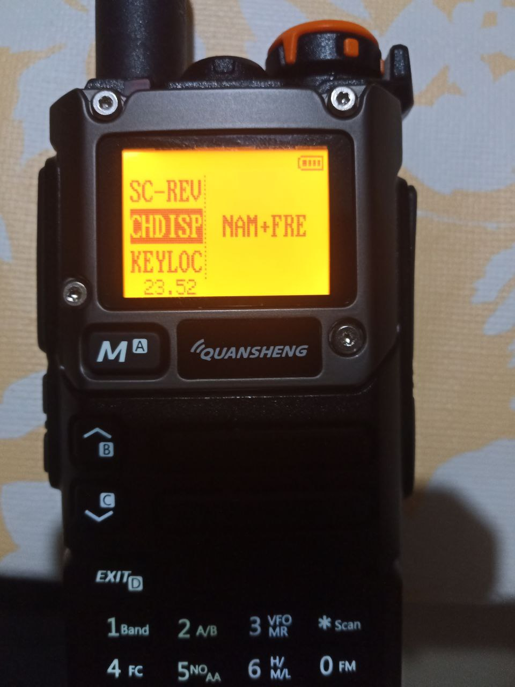
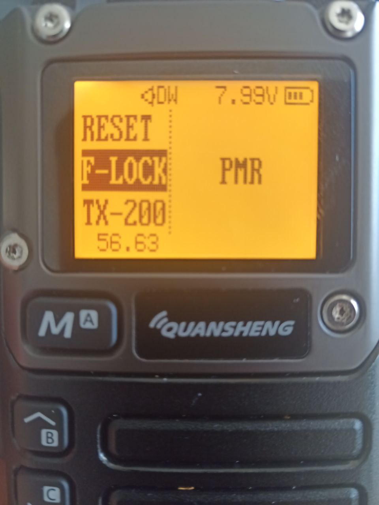

# Custom Firmware by OneOfEleven

# Open reimplementation of the Quan Sheng UV-K5 v2.1.27 firmware

This repository is a cloned and customized version of DualTachyon's open firmware found here ..

https://github.com/DualTachyon/uv-k5-firmware

A cool achievement

# Example changes/updates

  
  
  
  
  

 

Video showing the AM fix working ..

<video src="AM_fix.mp4"></video>

<video src="https://github.com/OneOfEleven/uv-k5-firmware-custom/assets/51590168/2a3a9cdc-97da-4966-bf0d-1ce6ad09779c"></video>

# New/modified function keys

* Long-press 'M' .. Copy selected channel into same VFO, then switch VFO to frequency mode
*
* Long-press '7' .. Toggle selected channel scanlist setting .. if VOX  is disabled in Makefile
* or
* Long-press '5' .. Toggle selected channel scanlist setting .. if NOAA is disabled in Makefile
*
* Long-press '*' .. Start scanning, then toggles the scanning between scanlists 1, 2 or ALL channels

# Some changes made from the Quansheng firmware

* Various Quansheng firmware bugs fixed
* Added new bugs
* Mic menu includes max gain possible
* AM RX everywhere (left the TX as is)
* An attempt to improve the AM RX audio (demodulator getting saturated/overloaded in Quansheng firmware)
* keypad-5/NOAA button now toggles scanlist-1 on/off for current channel when held down - IF NOAA not used
* Better backlight times (inc always on)
* Live DTMF decoder option, though the decoder needs some coeff tuning changes to decode other radios it seems
* Various menu re-wordings (trying to reduce 'WTH does that mean ?')
* ..

# Matoz Add-ons

F-LOCK PMR = ( Disables TX on all bands except PMR446 )

  

